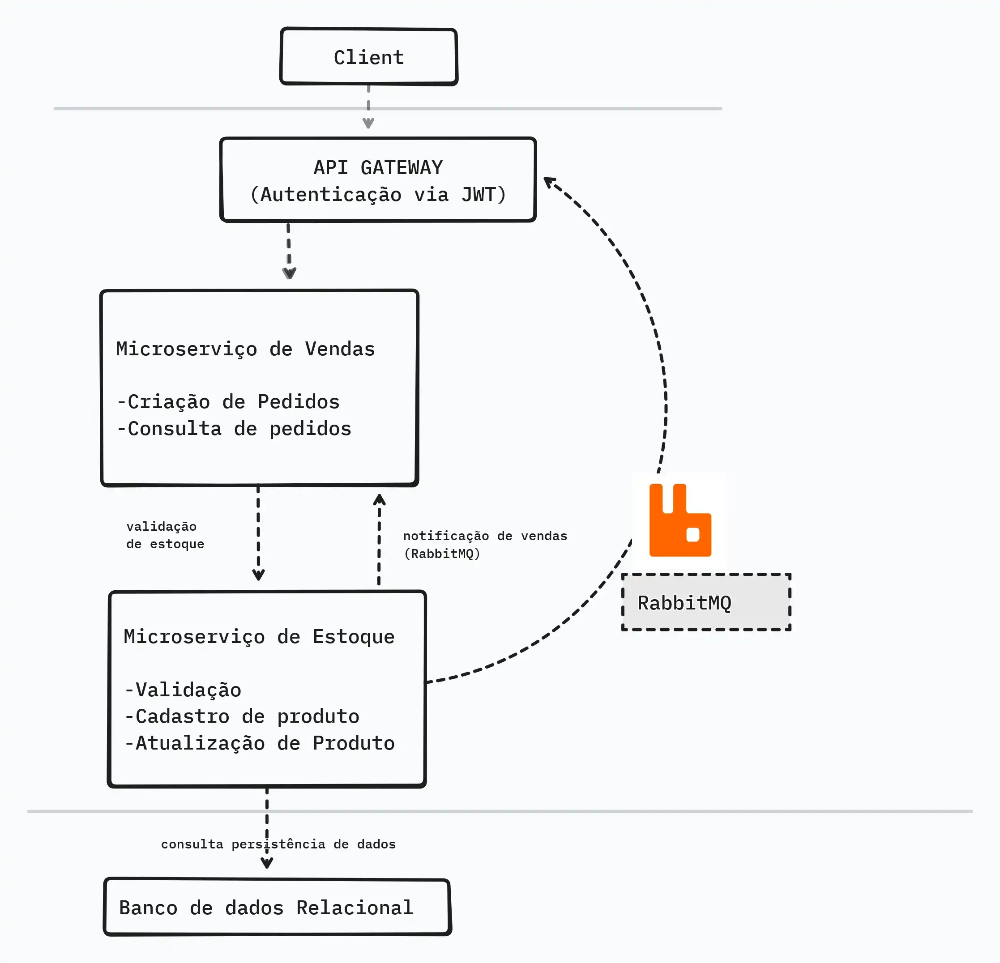

# Microserviços Ecommerce - API Gateway

Desenvolver uma aplicação com arquitetura de microserviços para gerenciamento de estoque de produtos e vendas em uma plataforma de e-commerce. O sistema será composto por dois microserviços: um para gerenciar o estoque de produtos e outro para gerenciar as vendas, com comunicação entre os serviços via API Gateway. 
---
---



---
## Tecnologias utilizadas

- .NET 9
- Entity Framework Core
- MySQL 8+
- JWT (JSON Web Tokens) para autenticação
- Swagger para documentação da API
- HttpClient para comunicação entre microserviços

---

## Funcionalidades

- CRUD de usuários (somente admin no momento)
- Autenticação via JWT
- Rotas de gateway para microserviços de **Vendas** e **Estoque**
- Endpoints protegidos por autenticação
- Swagger UI para testar a API
---

## Pré-requisitos
- [.NET 9 SDK](https://dotnet.microsoft.com/en-us/download/dotnet/9.0)
- MySQL 8+
- IDE como Visual Studio, Rider ou VS Code
---

## Instalação
1. Clone o repositório:
```bash
git clone https://github.com/LHonorato06/DesafioTecnicoAvanade.git
---

2. Entre na pasta do projeto:

cd MicroservicosEcommerce/ApiGateway
---

3. Configure a conexão com o banco no appsettings.json:

"ConnectionStrings": {
  "DefaultConnection": "Server=localhost;Database=Authgateway_db;User=root;Password=minhasenha;"
}
---

4. Execute as migrations para criar o banco e as tabelas:

dotnet ef database update
---

5. Rode o projeto:

dotnet run em todos os microserviços
---

6. Abra o Swagger UI para testar os endpoints:

http://localhost:5246/swagger

---

#Endpoints principais#

---
Autenticação

POST /login — Autentica o usuário e retorna um JWT.

Exemplo de request:

{
  "email": "admin@admin.com",
  "senha": "admin123"
}
---

Gateway Estoque

GET /gateway/estoque/produtos — Lista todos os produtos.

GET /gateway/estoque/produtos/{id} — Busca um produto por ID.

POST /gateway/estoque/produtos — Cria um produto.

PUT /gateway/estoque/produtos/{id} — Atualiza um produto.

DELETE /gateway/estoque/produtos/{id} — Remove um produto.

---

Gateway Vendas

GET /gateway/vendas/pedidos — Lista todos os pedidos.

GET /gateway/vendas/pedidos/{id} — Busca um pedido por ID.

POST /gateway/vendas/pedidos — Cria um pedido.

Todos os endpoints do gateway exigem um token JWT no header Authorization: Bearer <token>.

---

#Como gerar um token JWT#

1. Faça login usando o endpoint /login com o usuário admin:

{
  "email": "admin@admin.com",
  "senha": "admin123"
}
---

2. Copie o token retornado.

3. Use o token nas requisições protegidas ou no Swagger UI.
---

